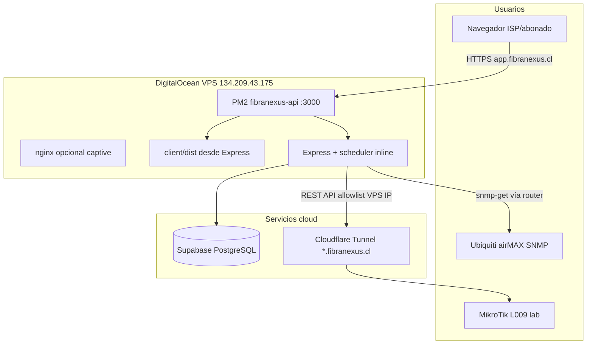

# FibraNexus Manager — Mapa del Proyecto

> **Referencia permanente** para Isai + Cursor.  
> **Última actualización:** 2026-09-01 (generado desde VPS + repo local)  
> **Producción:** https://app.fibranexus.cl  
> **GitHub:** https://github.com/Isai-1234/FibraNexus-Manager  
> **Commit en prod:** `3ecbbb6` · API v**1.2.9**

---

## ⚠️ Rutas importantes (no confundir)

| Qué | Ruta real | Notas |
|-----|-----------|--------|
| **VPS — código en producción** | `/root/app/` | ✅ Repo git activo, PM2 corre desde aquí |
| **VPS — path que a veces se menciona** | `/root/fibranexus-manager/` | ❌ **No existe** (2026-09-01). Symlink recomendado abajo |
| **PC Isai — workspace Cursor** | `C:\Users\Isaí\Documents\Cloude sesion\FibraNexus-Manager` | Puede diferir de `C:\Users\Isaí\Projects\...` |
| **SSH** | `ssh root@134.209.43.175` | Auth: llave `~/.ssh/id_ed25519` (sin password) |

```bash
# Crear alias de ruta en VPS (una sola vez):
ln -s /root/app /root/fibranexus-manager
```

---

## 1. Árbol de directorios (nivel 3)

```
FibraNexus-Manager/
├── client/                    # Frontend React + Vite + TS + Tailwind
│   ├── src/
│   │   ├── pages/             # Pantallas por rol (admin, portal, auth, platform)
│   │   ├── components/        # UI reutilizable (topología, charts, etc.)
│   │   ├── lib/               # theme, deviceWeb, helpers
│   │   └── assets/            # Iconos topología (torre, CPE)
│   └── dist/                  # Build servido por Express en prod
├── server/                    # Backend Express + Drizzle
│   ├── src/
│   │   ├── index.js           # Entrada API + static client/dist
│   │   ├── worker.js          # Worker jobs (PROCESS_ROLE=worker)
│   │   ├── routes/            # 26 routers REST
│   │   ├── lib/               # Lógica negocio (MikroTik, SNMP, billing…)
│   │   ├── middleware/        # auth, tenant
│   │   └── db/                # schema Drizzle + conexión
│   ├── migrations/            # SQL versionado 001–016
│   └── scripts/               # bootstrap, repair UTF-8, etc.
├── docs/                      # Documentación producto/lab/arquitectura
├── specs/001-red-isp-topology/ # Spec Kit: spec, plan, tasks
├── prototype/interactive/     # Prototipo browser sin backend (CodeSandbox)
├── scripts/                   # Migraciones globales, lab checks
├── deploy/                    # nginx captive configs
├── .cursor/rules/             # Reglas agente Cursor (7 archivos)
├── .specify/                  # Spec Kit workflows
├── render.yaml                # Deploy Render (documentado, no prod actual)
├── vercel.json                # Deploy frontend Vercel
├── CLAUDE.md                  # Contexto stack + scripts pnpm
└── PROJECT_MAP.md             # ← ESTE ARCHIVO
```

### Dónde está X (búsqueda rápida)

| Busco… | Archivo / carpeta |
|--------|-------------------|
| Login ISP / abonado | `client/src/pages/auth/IspLogin.tsx`, `Login.tsx` |
| Portal abonado | `client/src/pages/portal/ClientPortal.tsx` |
| Mora / captive | `client/src/pages/portal/SuspendedNotice.tsx`, `server/src/routes/publicCaptive.js` |
| Dashboard NOC | `client/src/pages/admin/Dashboard.tsx` |
| Topología red | `client/src/components/NetworkTopologyMap.tsx` |
| Red ISP tabs | `client/src/pages/admin/NetworkManager.tsx` |
| Pools de IPs | `client/src/pages/admin/NetworksIpPools.tsx`, `server/src/routes/ipManagement.js` |
| Inventario RF | `client/src/pages/admin/EquipmentInventory.tsx` |
| MikroTik script | `server/src/routes/routers.js`, `server/src/lib/mikrotik*.js` |
| Suspender abonado | `server/src/lib/subscriberSuspend.js`, `mikrotikSuspend.js` |
| Aislamiento multi-tenant colas | `server/src/lib/tenantNetworkFilter.js` |
| SNMP / señal CPE | `server/src/lib/snmpPoller.js`, `equipmentStatus.js` |
| Facturación | `server/src/routes/invoices.js`, `server/src/lib/billingScheduler.js` |
| Portal API | `server/src/routes/portal.js` |
| Schema DB | `server/src/db/schema.js` |
| Health / versión | `server/src/lib/healthCheck.js`, `GET /api/health` |
| Reglas Cursor | `.cursor/rules/*.mdc` |
| Lab MikroTik | `docs/lab-mikrotik-camino-a.md` |

---

## 2. Arquitectura (producción real vs documentado)

### Producción actual (2026-09-01)



### Documentado en repo (alternativa / parcial)

- **Render** — API (`render.yaml`)
- **Vercel** — SPA (`vercel.json`, `app.fibranexus.cl`)
- Hoy el **VPS sirve API + dist** en un solo proceso PM2

---

## 3. Stack técnico (versiones verificadas)

| Capa | Tecnología | Versión prod/local |
|------|------------|-------------------|
| Runtime | Node.js | **20.20.2** (PM2 VPS) |
| Package manager | pnpm | **10.12.1** (corepack) |
| API | fibranexus-server | **1.2.9** |
| Client | fibranexus-client | 1.0.0 |
| Framework FE | React | ^18.2.0 |
| Build FE | Vite | ^5.0.0 |
| BE | Express | ^4.18.2 |
| ORM | Drizzle | ^0.29.1 |
| DB | PostgreSQL (Supabase) | Cliente **16.15** en VPS |
| Process manager | PM2 | fibranexus-api + internetsur-api |
| Auth | JWT + bcrypt | — |
| SNMP | net-snmp | ^3.11.2 |

---

## 4. Infraestructura VPS

| Item | Valor |
|------|--------|
| Host | `134.209.43.175` (DigitalOcean) |
| Usuario | `root` |
| App path | `/root/app` |
| PM2 app | `fibranexus-api` |
| Script | `/root/app/server/src/index.js` |
| CWD PM2 | `/root/app/server` |
| Puerto | **3000** (`server/.env`) |
| Health | `curl http://127.0.0.1:3000/api/health` |
| Logs | `/root/.pm2/logs/fibranexus-api-*.log` |
| Node | vía nvm en `/root/.nvm` |
| Otro proceso | `internetsur-api` (segundo PM2) |

### Deploy manual (lo que hace Cursor/Isai)

```bash
ssh root@134.209.43.175
cd /root/app
git pull origin main
export NVM_DIR=/root/.nvm && . /root/.nvm/nvm.sh
pnpm --filter fibranexus-client build
pm2 restart fibranexus-api
curl -s http://127.0.0.1:3000/api/health | jq .commit
```

---

## 5. Configuración crítica (env)

Plantilla: `server/.env.example` (no commitear secretos reales).

| Variable | Propósito | Crítico |
|----------|-----------|---------|
| `DATABASE_URL` | Supabase Postgres | ✅ |
| `JWT_SECRET` | Tokens sesión | ✅ |
| `CREDENTIALS_ENCRYPTION_KEY` | Cifrado credenciales equipos | ✅ prod |
| `PORT` | Puerto API (3000 en VPS) | ✅ |
| `PUBLIC_URL` / `FRONTEND_URL` | URLs captive/portal | ✅ |
| `FIBRANEXUS_EGRESS_CIDRS` | Allowlist MikroTik Camino A | ✅ lab |
| `PROCESS_ROLE` | `all` \| `api` \| `worker` | Escala |
| `USE_JOB_QUEUE` / `REDIS_URL` | Cola jobs (no activar sin Redis) | ⚠️ |
| `FLOW_*` / `WEBPAY_*` | Pasarelas (stub default) | Opcional |
| `RESEND_API_KEY` | Email reset password | Opcional |

**Secrets viven en:** `server/.env` (VPS), paneles Render/Vercel si se usan, nunca en git.

---

## 6. API — mapa de rutas

Prefijo base: `/api`

| Router | Archivo | Función |
|--------|---------|---------|
| auth | `routes/auth.js` | Login, registro ISP, reset |
| clients | `routes/clients.js` | Abonados CRM |
| services | `routes/services.js` | Servicios internet |
| plans | `routes/plans.js` | Planes |
| invoices | `routes/invoices.js` | Facturación |
| payments | `routes/payments.js` | Pagos |
| portal | `routes/portal.js` | Portal abonado |
| publicCaptive | `routes/publicCaptive.js` | `/public/mora/:slug`, captive |
| equipment | `routes/equipment.js` | Inventario equipos |
| sites | `routes/sites.js` | Nodos/sitios |
| routers | `routes/routers.js` | MikroTik registro/scripts |
| edgeos | `routes/edgeos.js` | EdgeRouter, bandwidth |
| network | `routes/network.js` | Red general |
| ipManagement | `routes/ipManagement.js` | Pools IPs |
| devices | `routes/devices.js` | Detectados |
| tickets | `routes/tickets.js` | Soporte |
| workOrders | `routes/workOrders.js` | OT campo |
| settings | `routes/settings.js` | Ajustes org |
| platform | `routes/platform.js` | Superadmin SaaS |
| dashboard | `routes/dashboard.js` | KPIs |
| alerts | `routes/alerts.js` | Alertas org |
| finance | `routes/finance.js` | Finanzas |
| staff | `routes/staff.js` | Personal |
| webhooks | `routes/webhooks.js` | Pagos webhook |
| wisphub | `routes/wisphub.js` | Import WispHub |
| dte | `routes/dte.js` | DTE stub |

---

## 7. Frontend — pantallas por rol

| Rol | Componente shell | Pantallas clave |
|-----|------------------|-----------------|
| `superadmin` | `PlatformDashboard` | Panel plataforma FibraNexus |
| `admin` / staff | `AdminDashboard` | CRM, red, facturación, inventario |
| `client` | `ClientPortal` | Mi cuenta, pagar, tickets |
| Público | — | `/portal/:slug`, `/mora/:slug`, `/login` |

**Menú Red ISP (admin):** Topología · Redes & Pools · Detectados (`NetworkManager.tsx`)

---

## 8. Estado: qué funciona / roto / falta

| Área | Estado | Notas |
|------|--------|-------|
| Multi-tenant + aislamiento colas MikroTik | ✅ Funciona | `tenantNetworkFilter.js` — lab compartido L009 |
| Dashboard NOC (KPIs, Mbps, donut) | ✅ Funciona | Commit reciente |
| Topología UISP-style | ✅ Funciona | Validación lab pendiente T008–T009 |
| Redes & Pools IPs | ✅ Funciona | Migración 016 |
| Inventario señales RF | ✅ Funciona | Sectoriales + CPE vía SNMP/AP-station |
| Portal abonado (marca ISP) | ✅ Mejorado | Logout, fechas, enlace radio |
| Mora + captive HTTP | ✅ Lab validado | HTTPS no redirige sin MITM |
| PPPoE + Simple Queue onboarding | ✅ Camino principal | Ver reglas mikrotik-first-isp |
| Pagos Flow/Webpay live | ⏳ Falta | Stub en portal |
| Checkout mora sin login | ⏳ Falta | Solo portal con credenciales |
| DTE / SII producción | ⏳ Falta | Stub SimpleFactura |
| Cola Redis worker separado | ⏳ Falta | `USE_JOB_QUEUE` aborta si true sin Redis |
| Tests automatizados CI | ⚠️ Parcial | Solo algunos unit en server |
| Path VPS `/root/fibranexus-manager` | ⚠️ Confuso | Real: `/root/app` |
| Render deploy auto | ⚠️ Doc vs real | Prod = VPS PM2 |
| Prototipo interactivo CRM/Network | ✅ | `prototype/interactive`, CodeSandbox `m9f9tw` |

---

## 9. Lab conocido (QA)

| Item | Valor |
|------|--------|
| Org QA | **Nexus Sur QA** (`slug: nexus-sur-qa`) |
| Login ISP QA | `qa.isp.live.20260720@fibranexus.test` |
| Login abonado QA | `camila.rojas.qa@fibranexus.test` / `ClienteQa1234` |
| Router lab | MikroTik L009 Torre Pangui (túnel `*.fibranexus.cl`) |
| Allowlist API | `134.209.43.175/32` |
| Doc lab | `docs/lab-mikrotik-camino-a.md` |

---

## 10. Workflow Isai + Cursor

```
1. Isai abre Cursor en workspace FibraNexus-Manager
2. Pide feature/fix en español (como dueño ISP o dev)
3. Cursor:
   - Lee .cursor/rules/ y PROJECT_MAP.md
   - Edita client/ y/o server/
   - Prueba local: pnpm run dev:server + dev:client
   - O QA prod: login API, browser app.fibranexus.cl
4. Commit + push a main (cuando Isai lo pida)
5. Deploy VPS:
   ssh root@134.209.43.175
   cd /root/app && git pull && pnpm --filter fibranexus-client build
   pm2 restart fibranexus-api
6. Verificar: GET /api/health → commit + DB connected
7. Documentar hitos lab en docs/ el mismo día
```

### Reglas Cursor activas (`.cursor/rules/`)

| Archivo | Tema |
|---------|------|
| `specify-rules.mdc` | Spec Kit, feature 001-red-isp-topology |
| `mikrotik-first-isp.mdc` | Onboarding ISP, PPPoE, wall garden |
| `lab-network-learnings.mdc` | Validaciones lab Ubiquiti/MikroTik |
| `isp-owner-qa-fix.mdc` | QA como dueño ISP → reparar en ciclo |
| `github-deploy.mdc` | GitHub + deploy |
| `documentar-avances.mdc` | Docs en `docs/` |
| `datos-consistentes.mdc` | IPs/MAC coherentes en toda UI |

---

## 11. Roadmap — próximos pasos

1. **Portal:** checkout Flow en mora sin login (IP suspendida)
2. **Pagos:** Flow/Webpay live en portal (hoy stub)
3. **Topología:** cerrar validación lab T008–T027 (`specs/001-red-isp-topology/tasks.md`)
4. **Escala:** separar `PROCESS_ROLE=worker` + Redis cuando >20 ISPs
5. **Prototipo:** validar UX CRM/Network en CodeSandbox antes de código real
6. **Infra:** unificar docs (VPS vs Render/Vercel) o symlink `/root/fibranexus-manager`

---

## 12. Problemas conocidos y cómo arreglar

| Problema | Causa | Fix |
|----------|-------|-----|
| SSH pide password | Sin llave en máquina | Copiar `~/.ssh/id_ed25519` o usar PC con llave |
| `git pull` en path equivocado | Ruta `/root/fibranexus-manager` no existe | Usar `cd /root/app` |
| `node`/`pm2` not found en SSH | NVM no cargado | `. /root/.nvm/nvm.sh` antes de comandos |
| Colas de otro ISP en panel | MikroTik lab compartido | Filtro tenant — no quitar banners internos al ISP |
| Portal inputs oscuros | Tema dark del admin | Portal fuerza `.light` — ver `ClientPortal.tsx` |
| CPE offline lento | SNMP timeout | `ap-station` si AP reporta MAC |
| Build client falla en VPS | pnpm/node path | nvm + corepack enable |
| Health OK pero UI vieja | Solo restart API sin build | `pnpm --filter fibranexus-client build` |
| `USE_JOB_QUEUE=true` crash | Redis no configurado | Dejar false hasta Upstash/Redis |

---

## 13. Comandos de referencia

```bash
# Local dev
corepack enable && pnpm install
pnpm run dev:server    # :3000 API
pnpm run dev:client    # :5173 Vite

# Tests server (unit)
pnpm --filter fibranexus-server test

# Migraciones
pnpm --filter fibranexus-server run migrate

# Health producción
curl -s https://app.fibranexus.cl/api/health | jq .

# PM2 VPS
ssh root@134.209.43.175 '. /root/.nvm/nvm.sh && pm2 logs fibranexus-api --lines 50'
```

---

## 14. Historial reciente (git main)

```
3ecbbb6 Corregir fechas del portal: vencimientos sin desfase por zona horaria
1e6154e Madurar portal del abonado: marca ISP, enlace radio y UX clara
357dbc6 Cargar colas PPPoE automaticamente al seleccionar el router
1357749 Quitar avisos internos de la UI orientada al ISP
de4ae62 Aislar colas MikroTik por organizacion ISP
7b461f2 Tema dia calido y lista de abonados mas limpia
fec9921 Red ISP: Redes y Pools de IPs en lugar de Arbol
e16e497 Dashboard de red limpio estilo NOC sin Prospectos
```

---

## 15. Cómo actualizar este mapa

Cuando Isai diga **"actualiza PROJECT_MAP"** o **"cambió X"**:

1. Cursor re-ejecuta lectura VPS (`/root/app`, PM2, health, git log)
2. Actualiza secciones afectadas (no reescribir todo si no hace falta)
3. Commit `docs: actualizar PROJECT_MAP.md` + push
4. Copia a VPS: `/root/app/PROJECT_MAP.md`

---

*Generado automáticamente por Cursor para Isai — FibraNexus Manager.*
