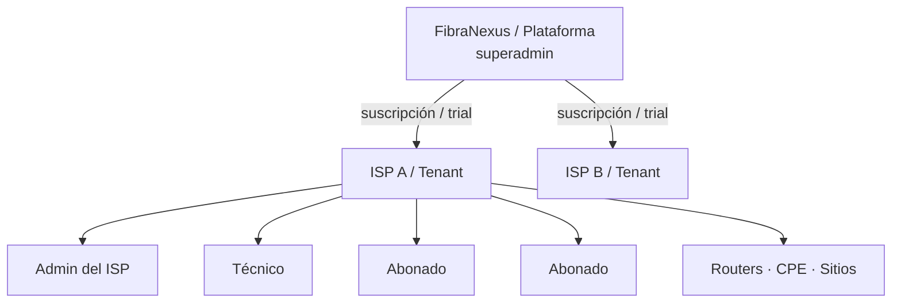

# FibraNexus Manager

**SaaS multi-tenant para ISPs chilenos.** Centraliza la operación comercial y técnica de un proveedor de internet: abonados, planes, facturación interna, soporte, red y monitoreo de equipos.

En concepto es comparable a WispHub o UISP Server, pero orientado a la operación completa del ISP (CRM + cobranza + red) bajo un modelo de suscripción mensual por organización.

---

## ¿Para quién es?

| Audiencia | Qué resuelve |
|-----------|--------------|
| **Dueño / admin del ISP** | Un solo panel para abonados, planes, boletas internas, pagos, tickets y red |
| **Técnico de campo o NOC** | Estado de routers y CPE, topología, detección de dispositivos, suspensión/reconexión |
| **Abonado final** | Portal para ver deuda, facturas internas y abrir tickets |
| **FibraNexus (plataforma)** | Administrar ISPs en trial o pago, límites y estado de cada organización |

---

## Jerarquía del producto



1. **FibraNexus** administra las organizaciones (ISPs) que contratan o prueban el sistema.
2. **Cada ISP** es un *tenant* aislado: sus datos no se mezclan con otros.
3. **El abonado** es el cliente final del ISP (persona o empresa con internet contratado).

Detalle de roles y permisos: [docs/roles-y-permisos.md](docs/roles-y-permisos.md).

---

## Qué hace hoy (resumen honesto)

| Área | Estado |
|------|--------|
| Multi-tenant + trial 14 días | **Implementado** |
| CRM de abonados, planes y servicios | **Implementado** |
| Facturación interna, pagos manuales, auto-suspensión por mora | **Implementado** / pagos online **planificado** |
| Portal del abonado (deuda, facturas, tickets) | **Parcial** (sin pago online ni PDF) |
| Topología de red, MikroTik, EdgeRouter (heartbeat), SNMP airMAX | **Implementado** |
| OLT/GPON profundo, SII/DTE, pasarelas de pago | **Planificado** |

Inventario completo: [docs/modulos.md](docs/modulos.md).

---

## Stack técnico

| Capa | Tecnología |
|------|------------|
| Frontend | React + Vite + TypeScript + Tailwind |
| Backend | Node.js (Express) + JWT |
| Base de datos | PostgreSQL (Drizzle ORM) |
| Despliegue | Vercel (UI) · Render (API) · Supabase (Postgres) |

Arquitectura: [docs/arquitectura.md](docs/arquitectura.md). Escala: [docs/escala.md](docs/escala.md).

---

## Arranque local

```bash
corepack enable
pnpm install
# Configurar DATABASE_URL y JWT_SECRET (ver server/.env.example)
pnpm run db:push   # desde server, o vía filter
pnpm run dev:server
pnpm run dev:client
```

| Paquete | Ruta | Scripts útiles |
|---------|------|----------------|
| `fibranexus-server` | `server/` | `dev`, `start`, `worker`, `db:push`, `db:seed` |
| `fibranexus-client` | `client/` | `dev`, `build` |

---

## Documentación

| Documento | Contenido |
|-----------|-----------|
| [docs/producto.md](docs/producto.md) | Visión, usuarios y propuesta de valor |
| [docs/arquitectura.md](docs/arquitectura.md) | Frontend, backend, DB, tenants, agentes |
| [docs/modulos.md](docs/modulos.md) | Implementado / parcial / planificado |
| [docs/roles-y-permisos.md](docs/roles-y-permisos.md) | Qué puede hacer cada rol |
| [docs/roadmap-mvp.md](docs/roadmap-mvp.md) | Camino a un MVP vendible |
| [docs/glosario.md](docs/glosario.md) | Términos ISP y de plataforma |
| [docs/escala.md](docs/escala.md) | Etapas de crecimiento e infra |
| [docs/plan-implementacion.md](docs/plan-implementacion.md) | Fases, dependencias y criterios de aceptación |
| [docs/avance-fases.md](docs/avance-fases.md) | Log de cierre por fase |
| [docs/auditoria-seguridad.md](docs/auditoria-seguridad.md) | Hallazgos y remediación de seguridad |

---

## Nota de alcance

Esta documentación describe el estado del código en el repositorio. Donde algo está incompleto se marca como **parcial** o **planificado**; no se presentan como disponibles funciones que aún no existen (pasarelas de pago, DTE/SII, auditoría operativa, etc.).
