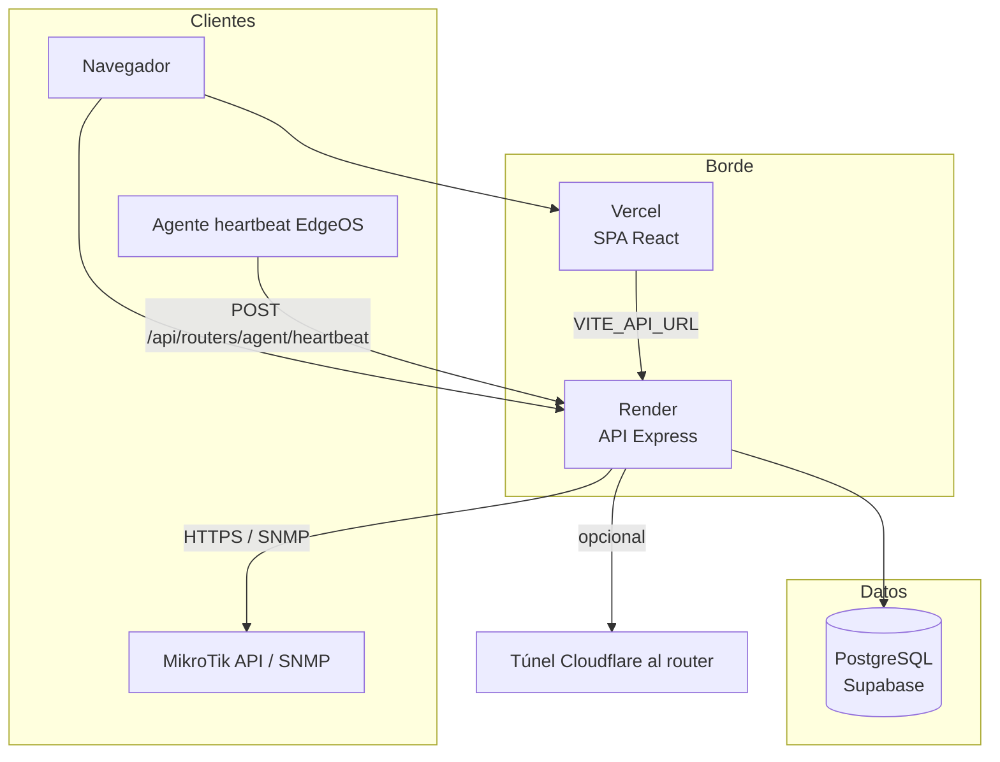
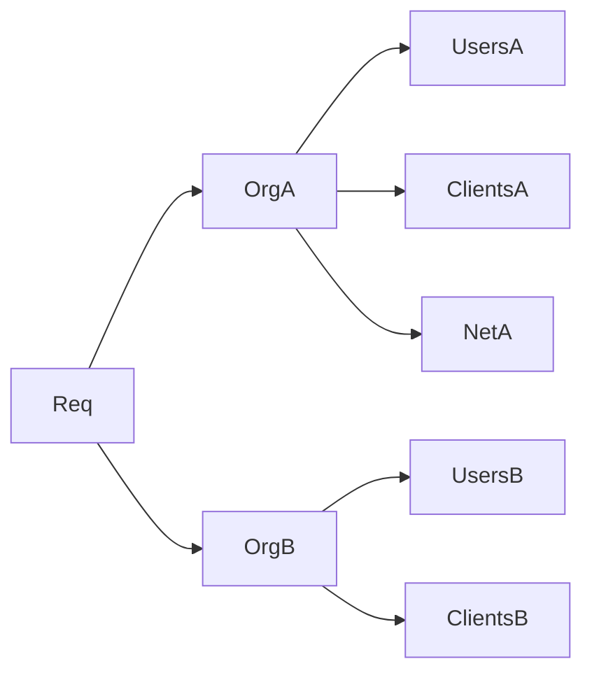
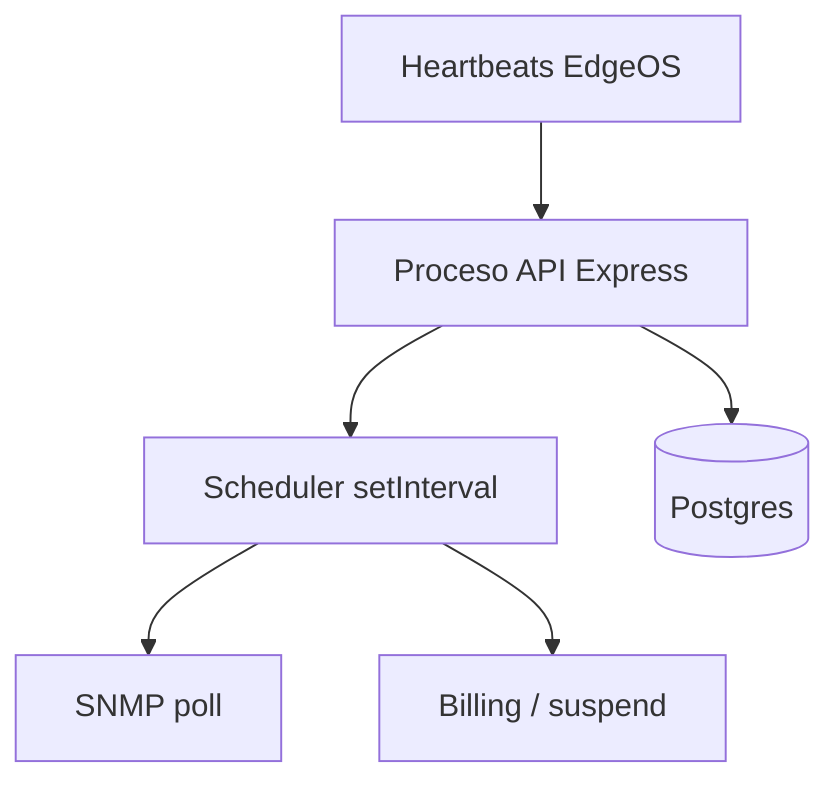

# Arquitectura — FibraNexus Manager

Documento basado en el código del monorepo (`client/`, `server/`). Estado al momento de la documentación.

---

## Vista general

| Pieza | Rol |
|-------|-----|
| **Frontend** | SPA en React; en producción puede servirse desde Vercel y/o desde el propio Express (`client/dist`) |
| **Backend** | API REST Express + scheduler en el mismo proceso (por defecto) |
| **DB** | PostgreSQL con Drizzle ORM |
| **Agentes de red** | Script heartbeat en EdgeRouter; conexión API a MikroTik; SNMP a equipos airMAX |

Más detalle de crecimiento: [escala.md](escala.md).

---

## Frontend

| Ítem | Detalle |
|------|---------|
| Stack | React 18, Vite, TypeScript, Tailwind, React Router, Axios, Lucide |
| Paquete | `fibranexus-client` (`client/`) |
| Auth | JWT en cliente; rutas `/login`, `/register`, `/suspended` |
| Shells por rol | `PlatformDashboard` (`superadmin`), `AdminDashboard` (`admin`/`technician`), `ClientPortal` (`client`) |
| Navegación ISP | Tabs internos en el dashboard (no deep-linking completo por módulo) |

Páginas relevantes: `client/src/pages/admin/*`, `portal/*`, `platform/*`, `auth/*`.

---

## Backend

| Ítem | Detalle |
|------|---------|
| Stack | Node ≥20, Express 4, JWT, bcryptjs, Zod, net-snmp |
| Paquete | `fibranexus-server` (`server/`) |
| Entrada | `server/src/index.js` |
| Auth | `middleware/auth.js` → `authenticateToken` + `requireRole(...)` |
| Tenant | `lib/tenant.js` → `requireActiveOrg`, trial, aislamiento por `organizationId` |

### Rutas API principales

| Prefijo | Ámbito |
|---------|--------|
| `/api/auth` | Login, registro de ISP |
| `/api/platform` | Solo `superadmin` |
| `/api/portal` | Solo `client` |
| `/api/clients`, `/plans`, `/services`, `/invoices`, `/payments`, `/tickets` | Operación ISP |
| `/api/equipment`, `/sites`, `/routers`, `/edgeos`, `/network`, `/devices` | Red |
| `/api/settings` | Ajustes de facturación por org |
| `/api/routers/agent/heartbeat` | Agente EdgeOS (sin JWT de usuario) |
| `/api/health` | Salud del servicio |

El servidor puede servir el build estático del cliente si existe `client/dist`.

---

## Base de datos

- **ORM:** Drizzle (`server/src/db/schema.js`).
- **Motor:** PostgreSQL.
- **Multi-tenant:** casi todas las tablas llevan `organizationId`.
- **Enums relevantes:** roles de usuario; estados de servicio (`active`, `suspended`, `cut`, `cancelled`, `pending`); facturas; tickets; tipos de equipo.

Entidades centrales:

| Tabla | Uso |
|-------|-----|
| `organizations` | Tenant ISP (plan, trial, límites, settings) |
| `users` | Cuentas (staff o abonado) |
| `clients` | Ficha CRM del abonado |
| `plans` / `client_services` | Catálogo y suscripciones |
| `invoices` / `payments` | Cobranza interna |
| `tickets` / `ticket_messages` | Soporte |
| `sites` / `equipment` | Topología e inventario |
| `detected_devices` / `device_metrics` | Detección y métricas |
| `ip_addresses` | IPAM básico |
| `activity_log` | **Esquema listo; escritura no implementada** |

Migraciones: `drizzle-kit push` / `runMigrations` al arrancar si hay `DATABASE_URL`.

---

## Multi-tenancy

- Registro self-service crea `organization` + usuario `admin` con trial ~14 días.
- Middleware `requireActiveOrg` bloquea orgs inactivas o trial vencido.
- `maxClients` / `maxRouters` se pueden editar desde plataforma; **hoy no se validan al crear** recursos (parcial).
- No hay impersonación de ISP desde superadmin.

---

## Agentes y red

### MikroTik

- Cliente REST (`mikrotikClient.js`) con credenciales en `equipment.credentials` (JSON; **sin cifrado a nivel app**).
- Provisioning, colas, suspensión (`mikrotikSuspend.js`), escaneo MAC/ARP/DHCP.

### EdgeRouter (EdgeOS)

- No hay API push permanente: el router ejecuta un **script heartbeat** (~cada 27s) hacia `/api/routers/agent/heartbeat`.
- El servidor responde con comandos pendientes (suspensión, red, etc.).
- Descarga corta de script: `GET /hs/:token`.
- Opcional: túnel Cloudflare embebido en flujos de instalación.

### SNMP

- Poller (`snmpPoller.js`) con OIDs Ubiquiti airMAX (señal, ruido, CCQ, etc.).
- Puede ir directo o delegado vía agente/router.
- Métricas históricas en `device_metrics`.
- OLT/GPON: solo tipo de inventario; **sin MIB GPON específico**.

### Scheduler

- Corre dentro del proceso Node (`lib/scheduler.js`) si `PROCESS_ROLE` permite worker.
- Facturación por hora configurada, mark overdue, SNMP, resolve IP, scan de dispositivos, stale heartbeat/CPE.

### Jobs / Redis

- Capa `dispatch()` preparada; `redisQueue.js` es **stub**.
- Por defecto todo corre **inline** en el mismo proceso.
- `worker.js` + `PROCESS_ROLE=worker` listos para separar procesos cuando exista cola real.

---

## Despliegue actual

| Componente | Dónde | Config |
|------------|-------|--------|
| API | Render | `render.yaml` — build pnpm + `pnpm --filter fibranexus-server start` |
| UI pública | Vercel | `vercel.json` — build `fibranexus-client` → `client/dist` |
| Postgres | Supabase (típico) | `DATABASE_URL` |
| CORS / links | Env | `FRONTEND_URL`, `VITE_API_URL`, `PUBLIC_URL`, `JWT_SECRET` |

Dominio de referencia en código/comentarios: `app.fibranexus.cl`.

---

## Seguridad (estado real)

| Tema | Estado |
|------|--------|
| Auth JWT + bcrypt | Implementado |
| Aislamiento por org | Implementado |
| Roles en rutas | Implementado (whitelist) |
| Credenciales de equipos cifradas | **No** (JSON plano) |
| Activity log / auditoría | **Tabla sí, uso no** |
| Rate limit por tenant | Planificado (ver escala) |

---

## Diagrama de procesos (runtime)

Cuando la escala lo exija: separar `PROCESS_ROLE=api` y `worker`, activar Redis. Ver [escala.md](escala.md).
