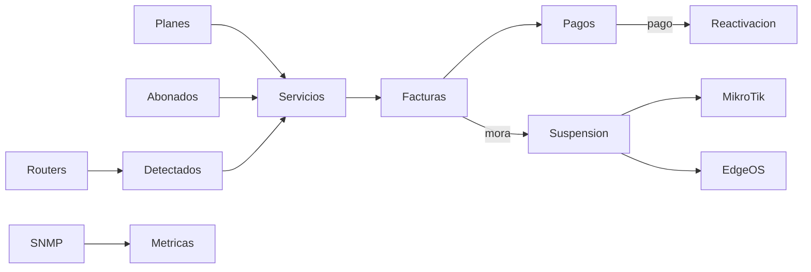

# Módulos — estado real

Leyenda:

| Etiqueta | Significado |
|----------|-------------|
| **Implementado** | Uso productivo en código (API y, en general, UI) |
| **Parcial** | Existe base, pero faltan piezas críticas o UI/enforcement |
| **Planificado** | Visión de producto; no hay implementación usable |

---

## Plataforma FibraNexus

| Módulo | Estado | Notas |
|--------|--------|-------|
| Panel superadmin (orgs, métricas) | **Implementado** | Suspender/reactivar, uso vs límites, actividad |
| Editar plan / trial / activo | **Implementado** | Incluye extender trial y catálogo SaaS |
| Límites maxClients/Users/Routers/Equipment | **Implementado** | `orgLimits.js` + retención métricas |
| Facturación SaaS al ISP (manual) | **Implementado** (núcleo) | `saas_invoices`; gateway después |
| Impersonar ISP | **Planificado** | — |

---

## Comercial / ISP

| Módulo | Estado | Notas |
|--------|--------|-------|
| Registro ISP + trial 14 días | **Implementado** | `auth.js` |
| CRM abonados (RUT, dirección, tags, geo) | **Implementado** | `clients.js`, `ClientDetail.tsx` |
| Planes de internet | **Implementado** | Tipos fiber/wisp/copper/wireless |
| Servicios / suscripciones | **Implementado** | Estados active/suspended/cut/cancelled/pending |
| Facturas internas | **Implementado** | Numeración interna, IVA 19% en cálculo; **sin PDF** |
| Pagos manuales + parciales | **Implementado** | Saldo / `partial` / `paid` (Fase 0 seguridad) |
| Pago online (Flow, Webpay, etc.) | **Planificado** | `flow` es solo opción de select |
| Webhooks de pago / conciliación | **Planificado** | Sin rutas webhook |
| SII / DTE | **Planificado** | Sin integración tributaria |
| Auto-generación de facturas (scheduler) | **Implementado** | Por org, hora configurable |
| Marcar vencidas | **Implementado** | Cada ~6 h |
| Auto-suspensión por mora | **Implementado** | MikroTik / cola EdgeOS |
| Auto-reactivación al pagar | **Implementado** | Tras pago manual registrado |
| Ajustes de facturación | **Implementado** | `BillingSettings.tsx` |

---

## Soporte

| Módulo | Estado | Notas |
|--------|--------|-------|
| Tickets ISP (CRUD, mensajes) | **Implementado** | Roles admin/technician |
| Tickets desde portal abonado | **Implementado** | Crear + responder |
| Asignación a técnico | **Parcial** | Campo `assignedTo` existe; flujo de asignación en UI limitado |

---

## Portal abonado

| Módulo | Estado | Notas |
|--------|--------|-------|
| Dashboard (servicio, deuda, facturas) | **Implementado** | |
| Abrir / seguir tickets | **Implementado** | |
| Pagar en línea | **Planificado** | Mensaje: contactar al ISP |
| Descargar documentos / PDF | **Planificado** | |
| Cambio de plan self-service | **Planificado** | |

---

## Red e inventario

| Módulo | Estado | Notas |
|--------|--------|-------|
| Sitios jerárquicos (parentId) | **Implementado** | Spec topología ~completa |
| Mapa / topología UI | **Implementado** | `NetworkTopologyMap.tsx` |
| Inventario de equipos | **Implementado** | Tipos incl. olt/ont/ap/cpe (genéricos) |
| Routers MikroTik (API) | **Implementado** | Provisioning, queues, suspend |
| EdgeRouter heartbeat + comandos | **Implementado** | Agente pull |
| Script instalación / túnel CF | **Implementado** | Embebido en flujos routers |
| SNMP Ubiquiti airMAX | **Implementado** | Señal, ruido, CCQ, etc. |
| SNMP genérico | **Parcial** | sysDescr/Name/Uptime; sin MIB OLT |
| Detección ARP/DHCP → dispositivos | **Implementado** | Adopción a servicio |
| Resolución IP dinámica | **Implementado** | Scheduler ~90 s |
| IPAM / pools | **Parcial** | API + UI básica |
| Config red en router (PPPoE/DHCP) | **Implementado** | Embebido en UI routers |
| Monitoreo OLT/GPON (ONUs, potencia) | **Planificado** | Solo tipo de equipo |
| Gestión Wi‑Fi/SSID AP | **Planificado** | Métricas wireless ≠ Wi‑Fi doméstico |
| Credenciales cifradas | **Implementado** (núcleo) | AES-GCM + sanitize API; migrar prod con script |
| Activity log / auditoría | **Parcial** | Escritura en auth/pagos/tokens/bajas; UI plataforma en Fase 1 |
| Alertas avanzadas (notificaciones) | **Planificado** | Offline vía status; sin canal alerta |

---

## Infra / plataforma técnica

| Módulo | Estado | Notas |
|--------|--------|-------|
| Health check | **Implementado** | `/api/health` |
| Scheduler en proceso | **Implementado** | |
| Cola Redis / BullMQ | **Planificado** | Stub en `redisQueue.js` |
| Worker separado | **Parcial** | Proceso existe; cola no |
| Tests automatizados | **Planificado** | Sin framework en package.json |

---

## Mapa de dependencias (operación)

---

## Referencia de código (entrada rápida)

| Área | Archivos clave |
|------|----------------|
| Schema | `server/src/db/schema.js` |
| Plataforma | `server/src/routes/platform.js` |
| Comercial | `clients.js`, `plans.js`, `services.js`, `invoices.js`, `payments.js`, `lib/invoiceService.js`, `lib/billingScheduler.js`, `lib/subscriberSuspend.js` |
| Portal | `routes/portal.js`, `pages/portal/ClientPortal.tsx` |
| Red | `routers.js`, `sites.js`, `devices.js`, `lib/snmpPoller.js`, `lib/mikrotik*.js`, `lib/macScanner.js` |
| Jobs | `lib/scheduler.js`, `lib/jobs/*` |
