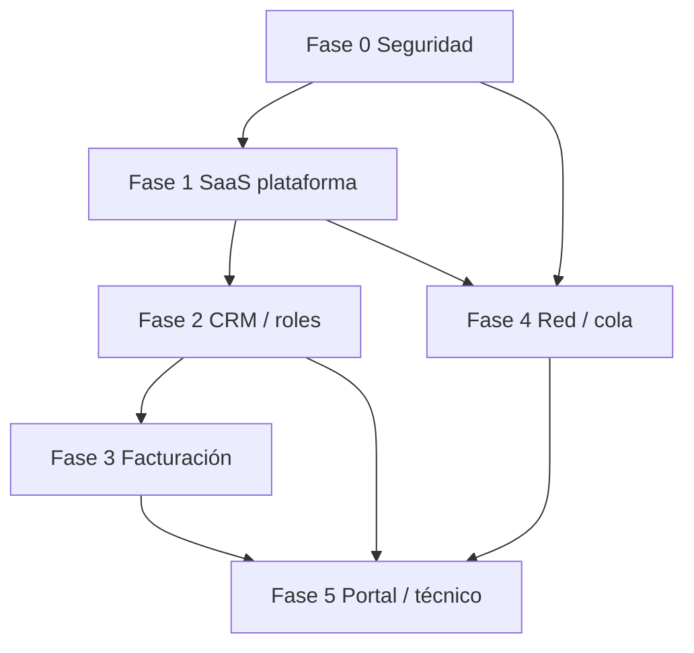

# Plan de implementación — MVP SaaS FibraNexus

**Tech lead:** ejecución fase por fase.  
**Regla:** no abrir la siguiente fase hasta build + pruebas verdes y criterios de aceptación cumplidos.  
**Seguimiento vivo:** actualizar la tabla de estado al cerrar cada fase.

| Fase | Nombre | Estado | Cierre |
|------|--------|--------|--------|
| 0 | Base segura y confiable | **Hecho** | 2026-07-18 |
| 1 | SaaS de FibraNexus | **Hecho** | 2026-07-18 |
| 2 | CRM y ciclo de vida del abonado | Pendiente | — |
| 3 | Facturación y pagos | Pendiente | — |
| 4 | Red y monitoreo | Pendiente | — |
| 5 | Portal de abonado y experiencia operativa | Pendiente | — |

Referencias: [roadmap-mvp.md](roadmap-mvp.md) · [auditoria-seguridad.md](auditoria-seguridad.md) · [modulos.md](modulos.md)

---

## Principios transversales

1. **Tenant isolation** en toda tabla/endpoint sensible (`organizationId`).
2. **Ningún secreto** al frontend (flags sí; valores no).
3. **Auditoría** en acciones administrativas relevantes.
4. **Integraciones externas:** reintentos, idempotencia, errores controlados.
5. **No borrar** historial financiero ni operacional crítico (baja lógica).
6. **Migraciones versionadas** en `server/migrations/` + `scripts/run-migrations.mjs`.
7. **Pruebas** por módulo crítico + `pnpm` build client antes de marcar fase.

---

## Fase 0 — Base segura y confiable

### Objetivo

Congelar una base en la que sea ético y seguro construir producto comercial. **Sin features nuevas** hasta cerrar esta fase.

### Dependencias

- Auditoría P0 ya documentada e implementada en repo (ver `auditoria-seguridad-avance.md`).
- Variables de entorno documentadas en `server/.env.example` (no tocar `.env` real en el repo).

### Alcance

| Ítem | Criterio |
|------|----------|
| Sin `/api/auth/setup` público | Confirmado en código + test |
| Secretos sanitizados / cifrados | API + UI + script migración |
| Pagos parciales correctos | `partial` / `paid` / saldo |
| Baja lógica abonado | No borra pagos/facturas pagadas |
| Aislamiento tenant + IP por org | Schema + tests contrato |
| Auth endurecida | Zod, rate limit, JWT, CORS, reset |
| Build + tests verdes | Obligatorio |

### Fuera de alcance Fase 0

- Panel SaaS enriquecido (Fase 1)
- Rol `administrativo` (Fase 2)
- Pasarelas / Redis real (Fases 3–4)

### Criterios de aceptación

- [ ] `node --test server/src/lib/__tests__/*.test.js` → pass
- [ ] `pnpm --filter fibranexus-client build` → pass
- [ ] Checklist deploy documentado (backup, `CREDENTIALS_ENCRYPTION_KEY`, migraciones)
- [ ] `docs/modulos.md` actualizado respecto a seguridad/pagos/límites

### Riesgos

| Riesgo | Mitigación |
|--------|------------|
| Producción sin `CREDENTIALS_ENCRYPTION_KEY` | Fallar escritura de secretos en `NODE_ENV=production`; checklist deploy |
| Rate limit / revoke JWT in-memory | Aceptable 1 dyno; Redis en Fase 4 |
| `migrate.js` legacy en boot | No bloquear Fase 0; migrar residual en Fase 1/4 |

### Entrega al cerrar

Resumen corto + actualizar esta tabla a **Hecho**.

---

## Fase 1 — SaaS de FibraNexus

### Objetivo

Que Isaí (superadmin) opere la plataforma como negocio: ver ISPs, trials, planes SaaS, uso, actividad, suspender/reactivar, con límites reales y modelo listo para cobrar la suscripción (gateway después).

### Dependencias

- Fase 0 cerrada.

### Alcance funcional

1. **Catálogo de planes SaaS** (`starter` / `pro` / etc.): precio referencial, `maxClients`, `maxUsers` (staff), `maxRouters`, `maxEquipment`, `metricsRetentionDays`.
2. **Organización enriquecida:** `subscriptionStatus` (`trial` \| `active` \| `past_due` \| `suspended` \| `cancelled`), `subscriptionEndsAt`, `lastActivityAt`, plan SaaS vinculado.
3. **Panel plataforma:** métricas, última actividad staff, uso vs límites, suspender / reactivar / extender trial / cambiar plan.
4. **Límites aplicados:** abonados, staff (admin+technician), routers, equipos; retención de métricas configurable (job de limpieza).
5. **Auditoría visible** para superadmin (últimos eventos por org).
6. **Diseño cobro SaaS:** tablas/campos `saas_invoices` (o equivalente) + estados; **sin** gateway real; registro manual de “pago recibido” por superadmin.

### Criterios de aceptación

- [x] Superadmin suspende ISP → staff recibe 402/403 y no opera
- [x] Reactivar restaura acceso
- [x] Crear abonado/router/equipo/staff respeta límites del plan
- [x] `lastActivityAt` se actualiza en login staff
- [x] Migración versionada `002_saas_platform.sql` (+ down)
- [x] Tests: límites/suspensión contratos + suite seguridad
- [x] Build client OK; UI plataforma muestra plan/estado/límites

### Riesgos

| Riesgo | Mitigación |
|--------|------------|
| Romper org Internetsur | Defaults compatibles; migración aditiva |
| Plan string libre vs catálogo | Migrar `organizations.plan` a slug de catálogo con fallback |

### Siguiente fase

Fase 2 (CRM) — necesita org estable y límites claros.

---

## Fase 2 — CRM y ciclo de vida del abonado

**Estado:** Hecho (MVP) — detalle en [fase-2-crm-avance.md](fase-2-crm-avance.md)

### Objetivo

Ficha 360° usable en venta y operación diaria; roles ISP precisos; historial inmutable.

### Dependencias

- Fase 1 (límites de usuarios staff).

### Alcance (resumen)

- Estados abonado/servicio: prospecto, instalación pendiente, activo, suspendido, cortado, cancelado.
- RUT validado (Chile), geo, equipos, tickets, pagos, deuda.
- Contratos/documentos/OT (mínimo viable) + baja lógica.
- Roles: `admin`, **`office`/`administrativo`**, `technician` con matriz de permisos.
- Invitación de staff desde UI.

### Criterios de aceptación (alto nivel)

- Administrativo no modifica routers/credenciales.
- Técnico no registra pagos ni borra abonados.
- OT con checklist y cierre auditado.
- Tests de permisos por rol (contratos unitarios; E2E con DB real pendiente).

### Riesgos

- Migración de roles existentes; mapear usuarios actuales. Aplicar `003` y `004` en prod.

---

## Fase 3 — Facturación y pagos

**Estado:** Hecho (MVP) — detalle en [fase-3-facturacion-avance.md](fase-3-facturacion-avance.md)

### Objetivo

Cobranza confiable ISP→abonado; adaptadores de pasarela; separación documento interno vs DTE futuro.

### Dependencias

- Fase 2 (ficha y roles oficina).

### Alcance (resumen)

- Saldos, ajustes, anulación, vencimiento, conciliación.
- Interface `PaymentGateway` + implementación stub; real solo con credenciales.
- Webhooks firmados, idempotentes, auditados.
- Avisos de deuda con proveedor de mensajería desacoplado (console/email stub).

### Riesgos

- Scope creep DTE — mantener explícitamente “interno”.

---

## Fase 4 — Red y monitoreo

### Objetivo

Inventario y monitoreo confiables; administración remota segura; cola de trabajos real.

### Dependencias

- Fase 0 secretos; ideal Fase 1 límites equipos.

### Alcance (resumen)

- Consolidar OLT/ONU/router/switch/AP/CPE.
- Alertas: offline, señal baja, mora, agente caído, fallo cobro.
- Redis/BullMQ **real** (o abortar `USE_JOB_QUEUE`).
- Acciones remotas: confirmación + permiso + auditoría + cola.

### Riesgos

- Complejidad MikroTik/EdgeOS en lab; validar con Internetsur.

---

## Fase 5 — Portal y experiencia operativa

### Objetivo

Abonado paga/consulta; técnico cierra visitas; marca del ISP.

### Dependencias

- Fase 3 (pagos); Fase 2 (OT).

### Alcance (resumen)

- Portal móvil simple: deuda, pago, documentos, tickets, estado.
- Branding por org (`logo`, colores en settings).
- Vista técnico: instalación, visita, fotos, cierre OT.

---

## Diagrama de dependencias

---

## Definición de “fase terminada”

1. Criterios de aceptación marcados.
2. Migraciones aplicadas en entorno de desarrollo (o documentadas).
3. Tests del módulo + suite seguridad existentes en verde.
4. Build client OK.
5. Entrada en este documento: estado **Hecho**, fecha, riesgos pendientes, **siguiente fase recomendada**.
6. Entrada espejo en `docs/avance-fases.md` (log corto por fase).

---

## Log de cierres

Ver [avance-fases.md](avance-fases.md) (se crea al cerrar Fase 0).
