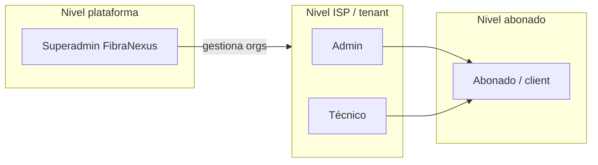

# Producto — FibraNexus Manager

## Visión

FibraNexus Manager es la plataforma operativa del ISP chileno pequeño y mediano: un lugar donde se juntan la **ficha del abonado**, la **cobranza** y el **estado de la red**, sin depender de planillas, WhatsApp y varios sistemas sueltos.

El modelo de negocio de FibraNexus es **SaaS multi-tenant**: cada ISP paga (o prueba) una suscripción mensual; FibraNexus opera la plataforma y aísla los datos de cada organización.

---

## Problema que resuelve

Un ISP típico hoy reparte su operación entre:

- Excel o CRM improvisado para clientes y RUT
- Contabilidad o boletas manuales para cobranza
- Acceso SSH/Winbox a routers para cortar o reconectar
- Grupos de chat para tickets y “¿está caída la antena?”

Eso escala mal, genera errores de corte, y deja al abonado sin un canal claro. FibraNexus concentra esas piezas en un solo producto.

---

## Propuesta de valor

| Para el ISP | Beneficio |
|-------------|-----------|
| Un panel | Abonados, planes, servicios, facturas internas, pagos y tickets en un solo lugar |
| Corte por mora | Suspensión y reconexión automática ligada a la red (MikroTik / EdgeOS) |
| Visibilidad de red | Topología, routers, CPE detectados, métricas SNMP (airMAX) |
| Portal al abonado | El cliente ve deuda, facturas internas y puede abrir tickets |
| Multi-tenant | Cada ISP aislado; FibraNexus administra trials y planes de plataforma |

**No es (aún):** un ERP contable completo, ni un emisor de DTE ante el SII, ni un sustituto total de UISP para radioenlaces Ubiquiti en todos los escenarios.

---

## Usuarios del sistema

| Usuario | Rol en código | Quién es |
|---------|---------------|----------|
| Dueño de FibraNexus | `superadmin` | Opera la plataforma SaaS |
| Administrador del ISP | `admin` | Dueño u operación comercial/técnica del ISP |
| Técnico del ISP | `technician` | NOC / campo con permisos técnicos limitados |
| Abonado final | `client` | Persona o empresa que contrata internet al ISP |

> **Nota:** en la visión comercial a veces se habla de un rol “administrativo” (solo cobranza/CRM, sin tocar red). **Ese rol no existe todavía en el código**; hoy solo hay `admin` y `technician` dentro del ISP. Ver [roles-y-permisos.md](roles-y-permisos.md).

---

## Niveles de cuenta

### 1. FibraNexus / Plataforma

- Ve organizaciones registradas, plan (`trial` u otro string), trial, activo/inactivo, conteos de abonados, routers, planes y tickets abiertos.
- Puede editar plan, límites (`maxClients`, `maxRouters`), extender trial y activar/desactivar el ISP.
- **Cobra** (fuera de esta app, por ahora) una suscripción mensual al ISP: **no hay facturación SaaS automatizada dentro del producto**.

### 2. ISP cliente / Tenant

- Organización aislada por `organizationId`.
- Administra abonados, planes, contratos/servicios, facturación interna, pagos manuales, soporte, técnicos (vía datos) y red.
- Trial self-service de **14 días** al registrarse; al vencer el trial sin plan activo, el acceso operativo se bloquea (HTTP 402).

### 3. Abonado final

- Ficha CRM: datos, RUT, dirección, servicios, plan, deuda, pagos, tickets.
- Portal: resumen de servicio, deuda pendiente, listado de facturas internas, creación y seguimiento de tickets.
- **Parcial:** no puede pagar en línea ni descargar PDF/documentos tributarios desde el portal.

---

## Operación comercial (visión)

- Catálogo de planes (fibra, WISP, cobre, wireless) con velocidades y precios.
- Servicios en estados: activo, suspendido, cortado, cancelado, pendiente.
- Facturas internas con vencimiento, IVA 19% en el cálculo actual, pagos registrados a mano.
- **Planificado:** pasarelas (Flow/Webpay), webhooks, conciliación automática, SII/DTE.

## Operación técnica (visión)

- Sitios y topología, inventario de equipos (router, switch, OLT, ONT, AP, CPE, etc.).
- Monitoreo online/offline, señal, ruido, CCQ (donde aplica SNMP airMAX), heartbeat EdgeOS.
- Integraciones actuales: SNMP Ubiquiti airMAX, agente heartbeat EdgeRouter, ARP/DHCP → dispositivos detectados, API MikroTik.
- **Planificado:** monitoreo GPON/OLT profundo, cifrado de credenciales, bitácora de auditoría operativa, gestión Wi‑Fi/SSID.

---

## Diferenciación (honesta)

| Frente a… | FibraNexus hoy |
|-----------|----------------|
| Solo billing | Incluye red y corte real por mora |
| Solo monitoreo (tipo UISP) | Incluye CRM, facturación interna y portal |
| Planillas + Winbox | Unifica datos y automatiza suspensión/reactivación |

El valor de venta del **MVP** no es “tener todas las integraciones del mercado”, sino **operar un ISP de punta a punta con lo esencial ya conectado a la red**. Detalle del camino: [roadmap-mvp.md](roadmap-mvp.md).
