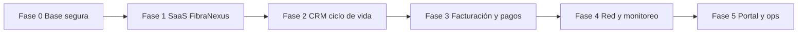

# Roadmap MVP — FibraNexus Manager

Objetivo: un SaaS **comercialmente vendible** para ISPs chilenos, con operación comercial + técnica + portal, sin afirmar pasarelas ni DTE hasta que existan.

Plan detallado por fases: [plan-implementacion.md](plan-implementacion.md)  
Seguridad: [auditoria-seguridad.md](auditoria-seguridad.md) · [auditoria-seguridad-avance.md](auditoria-seguridad-avance.md)

---

## Definición de MVP vendible

Un ISP piloto en producción puede:

1. Registrarse (trial) o ser activado desde el panel FibraNexus.
2. Gestionar abonados (RUT, dirección, servicios) y planes de internet.
3. Facturar internamente, registrar pagos (incl. parciales) y cortar/reconectar por mora en MikroTik/EdgeOS.
4. Ver topología básica, routers, CPE detectados y métricas SNMP airMAX.
5. Atender tickets (panel + portal del abonado).
6. FibraNexus (Isaí) ve orgs, trial/plan, uso, actividad y puede suspender/reactivar.

**Fuera del mensaje de venta del MVP:** Flow/Webpay en producción, SII/DTE, GPON profundo, app nativa.

---

## Estado actual (2026-07-18)

| Área | Estado |
|------|--------|
| Multi-tenant + trial | Implementado |
| Seguridad P0 (setup, secretos, pagos, aislamiento, auth) | **Remediado** — validar en deploy |
| Panel plataforma | Parcial (falta SaaS billing model, última actividad, suspensión formal) |
| CRM abonado | Implementado (falta rol administrativo, OT, contratos) |
| Facturación ISP→abonado | Parcial (parciales OK; sin pasarela ni PDF) |
| Red | Alertas org + EdgeOS confirm/audit; cola Redis diferida |
| Portal | Parcial (deuda + tickets; sin pago online) |

---

## Fases (resumen)

| Fase | Nombre | Meta comercial | Estado |
|------|--------|----------------|--------|
| **0** | Base segura y confiable | No vender con agujeros P0 | **Hecho** |
| **1** | SaaS de FibraNexus | Isaí opera ISPs, trials, límites, suspensión | **Hecho** |
| **2** | CRM y ciclo de vida | Ficha 360°, roles admin/administrativo/técnico, OT | **Hecho** |
| **3** | Facturación y pagos | Saldos, adaptadores pasarela, avisos | **Hecho** |
| **4** | Red y monitoreo | Inventario robusto, alertas, cola real | **Hecho (MVP)** — cola Redis diferida |
| **5** | Portal y experiencia ops | Pago portal, marca ISP, vista técnico | Pendiente |

Detalle, dependencias y criterios de aceptación: [plan-implementacion.md](plan-implementacion.md).

---

## Mensaje comercial (MVP)

> Opera tu ISP en un solo panel: abonados, cobranza interna, corte por mora ligado a MikroTik o EdgeRouter, y portal para deuda y tickets. FibraNexus administra tu cuenta SaaS (trial, plan y límites). Pasarelas de pago y boleta electrónica van en la hoja de ruta.

---

## Fuera de alcance deliberado (hasta post-MVP)

- DTE / SII
- Conciliación bancaria automática completa
- Sustituir UISP en todos los escenarios
- App móvil nativa
- Kubernetes / multi-región
