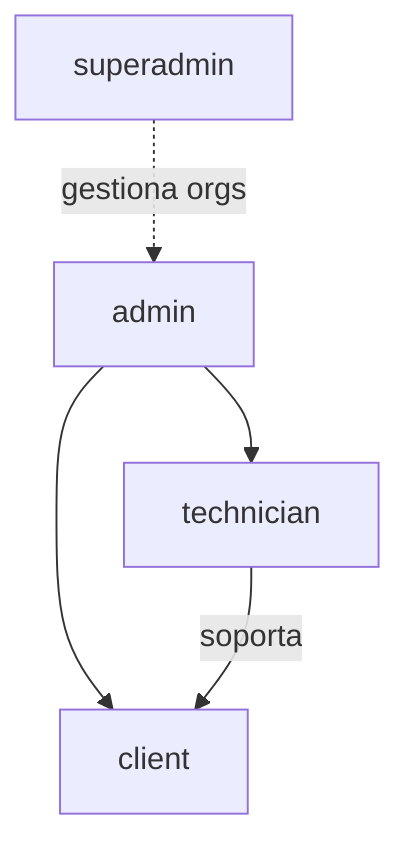

# Roles y permisos

Fuente de verdad: enum `user_role` en `server/src/db/schema.js` y `requireRole()` en las rutas Express.

## Roles existentes en código

| Rol | Quién | Alcance |
|-----|-------|---------|
| `superadmin` | Operador FibraNexus | Toda la plataforma; **no** opera un ISP concreto por las APIs de tenant |
| `admin` | Administrador del ISP | Control total de su organización |
| `technician` | Técnico del ISP | Lectura amplia + operaciones técnicas; sin CRUD comercial estructural |
| `client` | Abonado final | Solo `/api/portal` y su propia ficha |

**No existe** el rol “administrativo” (cobranza sin red). Está en visión de producto; hoy un usuario de oficina usa `admin` o queda fuera.

---

## FibraNexus (`superadmin`)

**Puede**

- Ver dashboard de organizaciones (abonados, routers, staff, planes, tickets abiertos, monto pendiente).
- Ver detalle de una org y su staff (`admin` / `technician`) con `lastLogin`.
- Editar nombre, email, plan, trial, `isActive`, `maxRouters`, `maxClients`.
- Extender período de prueba.

**No puede (hoy)**

- Entrar al panel operativo de un ISP como si fuera admin (sin impersonación).
- Cobrar automáticamente la suscripción SaaS al ISP.
- Crear organizaciones desde el panel (el alta típica es self-service en `/register`).

Rutas: `/api/platform/*`.

---

## Administrador del ISP (`admin`)

**Puede** (dentro de su `organizationId`)

| Área | Acciones |
|------|----------|
| Abonados | Crear, editar, eliminar, ver ficha 360° |
| Planes | CRUD |
| Servicios | Crear, editar, eliminar, suspender, reactivar, provisionar, sync queue |
| Facturas / pagos | Generar, listar, registrar pagos |
| Tickets | Gestionar y eliminar |
| Red | Sitios, equipos, routers, EdgeOS, detección, network config |
| Ajustes | Billing (auto-factura, mora, gracia, hora) |

**No puede**

- Ver datos de otros ISPs.
- Acceder a `/api/platform`.

---

## Técnico del ISP (`technician`)

**Puede**

- Ver abonados, planes, servicios, facturas (lectura), equipos y señal SNMP.
- **Suspender y reactivar** servicios (corte/restauración en campo tras reparar enlace).
- Provisionar / sync-queue en MikroTik.
- Operar red técnica: test conexión, stats, escaneo, SNMP, sitios (lectura), tickets (crear/actualizar/mensajes).
- Ver ficha 360° del abonado sin botones de cobranza ni alta/baja estructural.

**No puede** (API + UI alineados)

- Crear/editar/eliminar abonados.
- Crear/editar/eliminar planes o servicios.
- Registrar pagos ni crear boletas.
- Generar facturas masivas o por servicio.
- Crear/editar/eliminar routers, sitios o equipos en inventario.
- Cambiar ajustes de facturación ni staff.
- Eliminar tickets.

> **Hueco de producto:** no hay UI/API de invitación de técnicos. Hoy un `technician` se crea por seed o inserción manual en DB.

---

## Abonado (`client`)

**Puede**

- Ver su dashboard: servicios, plan, IP, estado, días como cliente.
- Ver deuda pendiente y listado de facturas internas.
- Crear tickets, ver detalle y responder mensajes.

**No puede**

- Pagar en línea desde el portal.
- Descargar PDF / documentos.
- Ver otros abonados ni datos del ISP.
- Acceder a APIs de administración.

---

## Matriz resumida

| Capacidad | superadmin | admin | technician | client |
|-----------|:----------:|:-----:|:----------:|:------:|
| Gestionar ISPs (plataforma) | ✓ | — | — | — |
| CRM abonados (escritura) | — | ✓ | — | — |
| Planes (escritura) | — | ✓ | — | — |
| Suspender servicio | — | ✓ | ✓ | — |
| Reactivar servicio | — | ✓ | ✓ | — |
| Borrar servicio | — | ✓ | — | — |
| Registrar pago / boleta | — | ✓ | — | — |
| Tickets ISP | — | ✓ | ✓ | — |
| Tickets propios (portal) | — | — | — | ✓ |
| Routers / sitios (escritura) | — | ✓ | — | — |
| Stats / scan / provision | — | ✓ | ✓ | — |
| Ajustes billing | — | ✓ | — | — |

---

## Mecanismos especiales

1. **Trial vencido:** `requireActiveOrg` responde 402; el frontend puede mostrar `/suspended`.
2. **Recuperación de acceso:** `ensureOrgStaffAccess()` puede promover un `client` a `admin` si la org se quedó sin staff activo con login (mecanismo de emergencia, no un rol nuevo).
3. **Agente EdgeOS:** autentica por `agentToken` del router, no por rol de usuario.

---

## Planificado (roles)

| Idea | Estado |
|------|--------|
| Rol `administrativo` (solo comercial) | Planificado |
| Invitar técnicos / staff desde UI | Planificado |
| Permisos granulares (RBAC fino) | Parcial — `client/src/lib/ispPermissions.ts` + menú por rol |
| Auditoría de quién hizo qué | Planificado (`activity_log` sin uso) |
