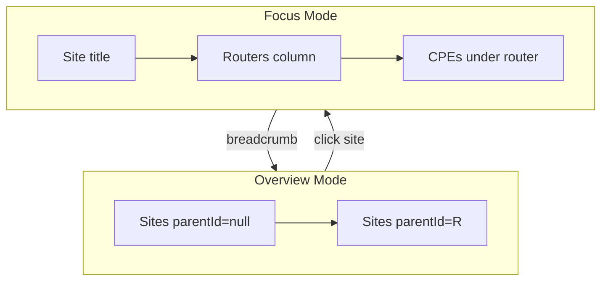

# Implementation Plan: Red ISP — Topología jerárquica

**Branch**: `main` (feature integrada; spec `001-red-isp-topology`)  
**Date**: 2026-06-10  
**Spec**: [spec.md](./spec.md)

## Summary

Vista de topología ISP con dos niveles: **overview** (árbol de sitios padre→hijo) y **drill-down** (routers/CPE dentro de un sitio). Conexiones estilo n8n (curvas + bus horizontal). Edición de nodos con `parentId`. La mayor parte del código ya está en `NetworkTopologyMap.tsx` y `NetworkManager.tsx`; este plan documenta la arquitectura y el trabajo restante.

## Technical Context

**Language/Version**: TypeScript 5.x (client), Node 20+ (server)  
**Primary Dependencies**: React 18, Vite, Express, Drizzle ORM  
**Storage**: PostgreSQL (Supabase) — tablas `sites`, `equipment`  
**Testing**: Manual lab Internetsur + quickstart.md  
**Target Platform**: Web (Render production, Vite dev)  
**Project Type**: Monorepo `client/` + `server/`  
**Performance Goals**: Render <100 nodos SVG sin lag perceptible  
**Constraints**: Sin nuevas deps de diagramming; diffs mínimos  
**Scale/Scope**: Multi-tenant ISP, decenas de sitios por org

## Constitution Check

| Principle | Status |
|-----------|--------|
| Multi-tenant isolation | ✅ sites/equipment filtrados por org |
| Minimal diff | ✅ cambios acotados a topology + network manager |
| Device IP → web UI | ✅ `openDeviceWeb` / `DeviceIpLink` |
| No secrets in repo | ✅ `.env.local` fuera de git |

## Project Structure

### Documentation (this feature)

```text
specs/001-red-isp-topology/
├── spec.md
├── plan.md              ← this file
├── research.md
├── data-model.md
├── quickstart.md
├── contracts/
│   ├── topology-ui.md
│   └── sites-api.md
└── tasks.md
```

### Source Code (touchpoints)

```text
client/src/
├── components/
│   ├── NetworkTopologyMap.tsx   # layout, drill-down, SVG paths
│   └── DeviceIpLink.tsx
├── lib/deviceWeb.ts
└── pages/admin/
    ├── NetworkManager.tsx       # tabs, edit site modal
    ├── RouterManager.tsx        # resolveHost fix
    └── Dashboard.tsx            # sidebar nav

server/src/
├── routes/sites.js              # tree, PATCH parentId
└── lib/healthCheck.js           # version string
```

**Structure Decision**: Web app monorepo existente; sin carpetas nuevas en runtime.

## Architecture



### Layout algorithms

1. **`computeOverviewLayout`**: raíces en fila superior; hijos en fila inferior; `buildConnectionPaths` con bus horizontal si >1 hijo.
2. **`layoutRouterColumn`**: routers apilados verticalmente centrados; CPEs bajo router asignado vía `assignCpesToRouters`.
3. **`flowPath`**: segmentos ortogonales + curvas cuadráticas en esquinas.

### Data flow

1. `NetworkManager` carga `GET /sites` → `tree`
2. Pasa `tree` + `selectedSiteId` a `NetworkTopologyMap`
3. Edición → `PATCH /sites/:id` → reload tree
4. Drill-down es estado local (`focusSiteId`); no persiste

## Phase 0 — Already Delivered (v1.2.8)

| Item | File | Status |
|------|------|--------|
| Overview site tree vertical | NetworkTopologyMap.tsx | Done |
| Drill-down routers/CPE | NetworkTopologyMap.tsx | Done |
| flowPath + bus connections | NetworkTopologyMap.tsx | Done |
| Edit site + parentId | NetworkManager.tsx | Done |
| deleteSite | NetworkManager.tsx | Done |
| RouterManager blank fix | RouterManager.tsx | Done |
| Sidebar Red ISP nav | Dashboard.tsx | Done |
| Version bump | package.json, healthCheck.js | Done |

## Phase 1 — Validation & Data (remaining)

1. Configurar lab: Nodo2.parentId = Torre Pangui
2. Verificar producción `/api/health` ≥ 1.2.8
3. Ejecutar quickstart.md checklist

## Phase 2 — Enhancements (optional, post-MVP)

1. **UI asignar CPE → router**: selector `parentId` en formulario equipo CPE (`EquipmentForm` o equivalente)
2. **UI parentRouterId**: en edición router, dropdown de router upstream del mismo sitio
3. **Sync tree ↔ topology**: al seleccionar sitio en Árbol, opcionalmente abrir drill-down en Topología
4. **Múltiples routers raíz**: validar apilado vertical cuando no hay `parentRouterId`

## Risks & Mitigations

| Risk | Mitigation |
|------|------------|
| Caché CDN bundle viejo | health version + hard refresh |
| CPE sin parentId | fallback router único del sitio |
| Ciclos parentId | UI excluye descendientes en select |

## Complexity Tracking

No constitution violations requiring justification.
